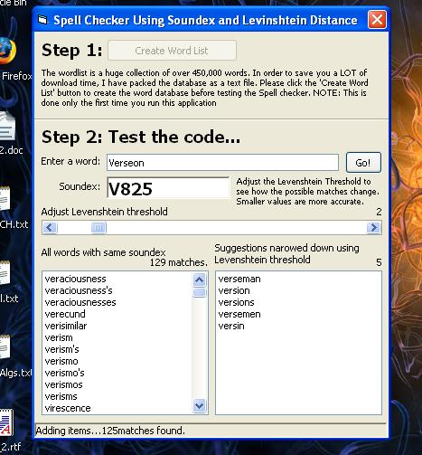



## A Comprehensive Spell Checker

### Description

This is a comprehensive Spell Checker application which uses an internal database of over 450,000 words! Uses the Soundex and Levenshtein Distance Algorithms to fully emulate a word processor spell checker. The number of possible results can be adjusted too. All algorithms, additional work etc is fully documented. Votes welcome.
 
### More Info
 

             |
---                |---
**Submitted On**   |2006-07-17 17:19:20
**By**             |[Shelz](https://github.com/Planet-Source-Code/PSCIndex/blob/master/ByAuthor/shelz.md)
**Level**          |Intermediate
**User Rating**    |5.0 (129 globes from 26 users)
**Compatibility**  |VB 6\.0
**Category**       |[Miscellaneous](https://github.com/Planet-Source-Code/PSCIndex/blob/master/ByCategory/miscellaneous__1-1.md)
**World**          |[Visual Basic](https://github.com/Planet-Source-Code/PSCIndex/blob/master/ByWorld/visual-basic.md)
**Archive File**   |[A\_Comprehe2007317182006\.zip](https://github.com/Planet-Source-Code/shelz-a-comprehensive-spell-checker__1-65992/archive/master.zip)

